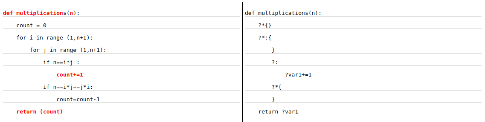

# Pyttern


Pyttern is a python library to create patterns file for Python code.

## Syntax

We extended the python syntax to create patterns file. Our new syntax include the following elements:

| Wildcard          | Description                                                               |
|-------------------|---------------------------------------------------------------------------|
| ?                 | Match 1 element                                                           |
| ?*                | Match 0 or more elements                                                  |
| ?{name}           | Match 1 element and bind it to {``name``}                                 |
| ?:                | Match 1 element with a body                                               |
| ?*:               | Match the body of the wildcard in any indentation                         |
| ?<...>            | Match if the inside of the wildcard is contained inside the matching node |

In addition to these wildcards, we added some optional elements to allow more options:

| Option       | Description                            |
|--------------|----------------------------------------|
| ?[Type, ...] | Match 1 element of type ``Type``       |
| ?{n, m}      | Match between ``n`` and ``m`` elements |


## Usage

```python

import Matcher

code = "code_file.py"
pattern = "pattern_file.py"
match = Matcher.match_files(pattern, code, strict_match=False, match_details=False)
if match:
    print("We found a match")
else:
    print("No match")
```
The `match_files` function takes 4 arguments:
1. `pattern_file: string` The path to the file describing the pattern
2. `code_file: string` The path to the python code file
3. `strict_match: boolean` (optional) When strict_match is set to True, a strict match is performed. 
A strict match requires an exact match between the code file and the pattern file, including code structure and syntax. 
If strict_match is set to False, a "soft" match is performed, which allows for flexibility in code sections using wildcards.
4. `match_details: boolean` (optional) If match_details is set to True, the function returns a tuple (result, details), 
where result is a boolean value indicating whether the code matches the pattern. 
If result is True, details contains the match details. If result is False, details contains the error that prevented the match.


## Examples
### Python code:
```python
def multiplications(n):
    """
    pre:  n is a positive integer
    post: Return the number of distinct decompositions a,b 
          such that n == a*b == b*a
    """
    b=n
    a=1
    c=0
    while a*b==n:
        c=a*(b/a)
        a+=1
    return c
```
### Pattern file:
#### Soft match
```python
def multiplications(n):
    ?var1 = ?       # We want to have a initial variable
    ?*:
        ?var1 = ?   # This variable has to be updated somewhere
    return ?var1    # And we want to return it
```
#### Strict match
```python
def multiplications(n):
    ?*
    ?var1 = ?       # We want to have a initial variable
    ?*
    ?*:
        ?*
        ?var1 = ?   # This variable has to be updated somewhere
        ?*
    return ?var1    # And we want to return it
```

Those two piece of codes describes the same patterns. The soft match hide the multiple wildcards `?*` in the strict match.


## Strict match / Soft match
### Main difference
In a soft match, there is flexibility in code structure and the possibility of including extra code, 
as long as the main matching criteria are met. In contrast, in a strict match, precise adherence to the defined 
code structure and syntax is necessary, and there is limited to no allowance for variations or 
additional code outside the specified structure.

### The syntax `?:[]`
The wildcard `?![]` is a notation that allows for a combination of strict and soft matching in certain parts of a code pattern. It is useful when you want to perform a soft match but have a strict match requirement within a specific section of code.

Let's consider an example to illustrate this. Suppose we have the following pattern:

```python
def foo(bar):
    ?var = 0
    for ? in range(?*):
        ?![
        if ?:
           ?var += 1 
        !]
```
In this pattern, the wildcard ? represents a placeholder for any valid Python identifier. The ?var = 0 statement assigns the value 0 to a variable, which we'll refer to as x. The for ? in range(?*) loop iterates over a range of values, which we'll refer to as y. Finally, ?![ ... ] represents a strict match requirement that enforces certain code within the if statement.

Now, let's say we have the following code snippet:

```python
def foo(bar):
    x = 0
    y = len(bar)
    for i in range(y):
        z = bar[i]
        if z:
            x += 1
    return x
```
We want to match this code snippet with the given pattern. Let's go through each line and see how the wildcard ?![] allows for matching.

- In the pattern, `?var = 0` matches the code `x = 0` because the wildcard `?var` represents the variable named `x`.
- The loop statement `for ? in range(?*)` in the pattern matches the code `for i in range(y)`. 
- Here, `?` corresponds to the loop variable `i`, and `?*` corresponds to the length of the bar list, which is stored in `y`.
- The strict match requirement `?![ ... ]` checks the code within the if statement. 
- In the pattern, `?` represents the condition `z`, and `?var += 1` corresponds to `x += 1` within the if block.

As a result, the code snippet matches the pattern because all the placeholders and the strict match requirements are satisfied. 
However, if we have additional code within the if block, such as a print statement like `print("true")`, 
the pattern won't match because the strict match requirement `?![ ... ]` doesn't accommodate that extra code.

In summary, the wildcard `?![]` allows for a combination of soft and strict matching. 
It provides flexibility by allowing soft matches for variables and loop structures while enforcing strict matches for 
specific code sections. This helps in creating adaptable code patterns that can match similar code snippets with some variations.

# Flexibility
To add some flexibility to our pattern we implemented different features.

## Wildcards Options
We added some options to put on the wildcards:
1. `?[Type1, Type2, ...]` allows to specify the type of the element to match.
2. `?{n, m}` allows to specify the number of elements to match. It can be used with or without the type option.
This option can be used in five different ways:
    1. `?{n, m}`: Match between `n` and `m` elements
    2. `?{n, }`: Match at least `n` elements
    3. `?{, m}`: Match at most `m` elements
    4. `?{n}`: Match exactly `n` elements
    5. `?{0}`: Create a `not` wildcard. For example: `?:{0}` will ensure that the current element does not have a body.

## Augassign
We implemented a match between `augassign` and `assign`. For example, the pattern `x = x + 1` will match `x += 1` and the 
pattern `x += 1` will match `x = x + 1`.


## [WIP] Visualization 
You can visualize the pattern match using the `match_details` argument and the visualiser.

```python
from src.pyttern import Visualizer
import Matcher

code = "code_file.py"
pattern = "pattern_file.py"
val, match = match_files(pattern, code, strict_match=False, match_details=True)

output_file = "example.html"
html = Visualizer.match_to_hml(match, code, pattern)
html.write(output_file)
```
